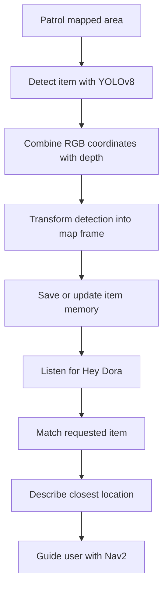

# Dora: Lost & Found Robot

Dora is an autonomous lost-and-found assistant built with ROS 2, Nav2, and YOLOv8. The robot patrols a mapped indoor environment, detects common personal items with an RGB-D camera, saves their locations in the map frame, and answers spoken questions such as:

> "Hey Dora, have you seen my water bottle?"

If Dora has seen the requested item, it describes the closest saved location and can guide the user to it.

## Features

- Autonomously patrols a configurable area using Nav2
- Detects seven item classes with a pretrained YOLOv8 model
- Converts image detections and depth readings into map-frame coordinates
- Stores multiple locations for each type of item
- Filters duplicate detections within 0.6 meters
- Removes stale memories when a previously saved object is no longer visible
- Accepts natural voice queries using a wake phrase
- Describes an item's distance and cardinal direction from the robot
- Guides the user to the closest matching item
- Stops for nearby obstacles and resumes when the path clears
- Detects navigation stalls and selects a recovery goal
- Falls back to typed input when speech recognition is unavailable
- Displays live camera detections and a system-status dashboard

## Supported Items

Dora currently recognizes:

- Backpack
- Bottle
- Cup
- Umbrella
- Handbag
- Laptop
- Cell phone

Common aliases are supported. For example, `water bottle`, `Hydro Flask`, and `drink bottle` are interpreted as `bottle`, while `bag`, `bookbag`, and `school bag` are interpreted as `backpack`.

## How It Works



1. **Patrol:** Dora selects clear waypoints inside the user-defined patrol radius.
2. **Detect:** YOLOv8 identifies supported objects in the RGB image.
3. **Localize:** The center of each bounding box is paired with a depth measurement and transformed from the camera frame into the ROS `map` frame.
4. **Remember:** Dora stores unique item coordinates and tracks whether saved objects remain visible.
5. **Query:** After hearing a wake phrase, Dora extracts the requested item from the user's question.
6. **Respond:** Dora reports the closest item's approximate distance and cardinal direction.
7. **Guide:** If requested, Dora sends the item's coordinates to the Nav2 `NavigateToPose` action and leads the user there.

## Tech Stack

- Python
- ROS 2 (`rclpy`)
- Nav2
- YOLOv8 / Ultralytics
- OpenCV and `cv_bridge`
- RGB-D imaging
- LiDAR
- TF2 coordinate transforms
- SpeechRecognition
- `pyttsx3`

YOLO inference is configured to run on the CPU.

## ROS Interfaces

The current implementation expects the following ROS interfaces:

| Interface | Type | Purpose |
| --- | --- | --- |
| `/rgb/image_raw` | `sensor_msgs/Image` | RGB camera frames |
| `/depth_to_rgb/image_raw` | `sensor_msgs/Image` | Depth aligned with the RGB image |
| `/rgb/camera_info` | `sensor_msgs/CameraInfo` | Camera intrinsics |
| `/scan` | `sensor_msgs/LaserScan` | Obstacle detection |
| `/global_costmap/costmap` | `nav_msgs/OccupancyGrid` | Clear-waypoint validation |
| `map -> base_link` | TF2 transform | Robot pose in the map frame |
| `navigate_to_pose` | `nav2_msgs/NavigateToPose` | Patrol and guidance goals |

If your robot uses different topic or frame names, update them in `lost_found/dora.py`.

## Prerequisites

- Ubuntu with a working ROS 2 installation
- Nav2 configured for the robot
- An RGB-D camera publishing aligned color and depth images
- A 2D LiDAR publishing `LaserScan` data
- A valid TF tree connecting the camera, `base_link`, and `map` frames
- Python 3
- A microphone and speakers for voice interaction (optional)

## Installation

### 1. Clone the repository

```bash
git clone https://github.com/jimjamms/lost_found.git
cd lost_found
```

### 2. Source ROS 2

Replace `<distro>` with your installed ROS 2 distribution, such as `humble` or `jazzy`.

```bash
source /opt/ros/<distro>/setup.bash
```

Also source your robot workspace if its camera, navigation, or description packages are built there:

```bash
source /path/to/your/ros2_workspace/install/setup.bash
```

### 3. Install Python dependencies

```bash
python3 -m pip install ultralytics numpy opencv-python SpeechRecognition pyttsx3
```

For microphone input on Ubuntu:

```bash
sudo apt update
sudo apt install portaudio19-dev python3-pyaudio
python3 -m pip install pyaudio
```

ROS packages such as `rclpy`, `cv_bridge`, `tf2_ros`, `tf2_geometry_msgs`, and `nav2_msgs` should be installed through ROS rather than `pip`.

### 4. Verify voice dependencies

```bash
python3 -c "import speech_recognition, pyttsx3, pyaudio; print('voice libraries ready')"
```

Voice input is optional. If the microphone libraries are unavailable or speech recognition fails during a follow-up prompt, Dora can fall back to typed input.

## Running Dora

Start the robot's camera, LiDAR, localization, TF, costmap, and Nav2 nodes first. Then run Dora from the directory containing `dora.py` and `yolov8n.pt`:

```bash
cd lost_found
python3 dora.py
```

Enter a patrol radius in meters when prompted. Press Enter to use the default radius of `3.0` meters.

Two OpenCV windows should appear:

- **Kinect AI Feed:** live detections, confidence scores, and memory status
- **Voice Scout Status:** navigation, voice, request, obstacle, and saved-object state

## Example Voice Commands

Begin requests with a supported wake phrase such as `Hey Dora`, `Hello Dora`, `Hey Robot`, or `Scout`.

```text
Hey Dora, have you seen my water bottle?
Hey Dora, where is the backpack?
Hey Dora, can you guide me to my laptop?
Hey Dora, show me the closest cup.
Never mind.
```

When Dora reaches a saved location, it asks whether the item is correct. If it is not, Dora can continue to another saved instance of that item.

## Safety and Recovery

- LiDAR readings closer than approximately `0.55 m` trigger a navigation stop after three consecutive detections.
- Navigation resumes after the obstacle has cleared and a short delay has elapsed.
- The watchdog detects short stalls and sends an escape goal.
- If the robot makes little progress for 12 seconds while patrolling, Dora cancels the current goal and chooses a new one.
- Candidate patrol goals are checked against the global costmap before they are sent to Nav2.

These behaviors are experimental and are not a substitute for the robot platform's built-in collision avoidance, emergency stop, or responsible human supervision.

## Project Structure

```text
lost_found/
├── lost_found/
│   ├── dora.py          # Main vision, memory, voice, and navigation node
│   ├── voice_query.py   # Voice-query experiments
│   ├── return.py        # Navigation experiments
│   ├── test*.py         # Earlier prototypes and tests
│   ├── commands.txt     # Development commands
│   ├── readme.txt       # Original voice setup notes
│   └── yolov8n.pt       # YOLOv8 Nano model weights
└── test_copy_new        # Development snapshot
```

## Current Limitations

- Object memory is stored in RAM and is cleared when the program exits.
- Detection uses pretrained YOLOv8 classes rather than a custom lost-item dataset.
- Camera topics, navigation interfaces, and TF frame names are currently configured in the source code.
- Speech recognition may require internet access because the implementation uses Google's recognizer.
- The repository currently runs the main node as a Python script rather than as an installed ROS 2 package with a launch file.
- Detection accuracy and map localization depend on camera calibration, depth quality, lighting, and the robot's TF configuration.

## Future Improvements

- Persist item locations across sessions with a database
- Add timestamps and confidence histories to saved detections
- Provide a map-based user interface for browsing found items
- Train or fine-tune a detector for campus-specific belongings
- Move topics, thresholds, and patrol settings into ROS parameters
- Add a ROS 2 package manifest, entry point, and launch file
- Add automated tests for query parsing, memory updates, and navigation state transitions

## Acknowledgments

This project was developed as part of the Freshman Research Initiative's autonomous robotics program at The University of Texas at Austin.

## License

No license file is currently included. Add a license before distributing or reusing the project outside its intended academic context.
